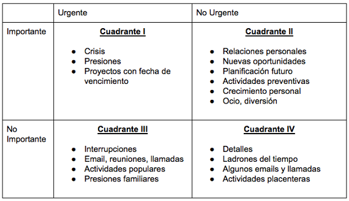

# Estrategias para aprender en línea efectivamente

# 1.¿Qué es el Aprendizaje?

**"Nunca pares de aprender"**

---

[https://youtu.be/VcjzHMhBtf0](https://youtu.be/VcjzHMhBtf0)

# 2.**¿Qué es aprender?**

**Aprender** es la capacidad de adquirir conocimiento 

- Perseguir
- Atrapar
- Prender

Darle un sentido para algo especifico

Apoderarse de algo. Hacerlo más poderoso en ti. Compartirlo y genérate una opinión sobre ese conocimiento 

---

# 3.Tipos de Pensamiento

[https://barbaraoakley.com/](https://barbaraoakley.com/)

## 3.1. Dos tipos de pensamiento

Cuando aprendemos algo tenemos pequeños chongs o pequeños trozos de información, donde cada neurona juega un papel especial. Cuando empezamos a unir el aprendizaje y a unir la información las neuronas empiezan a unirse creando estructuras neuronales de conocimiento. A medida que vamos aprendiendo y vamos uniendo más trozos de información, vamos generando más estructuras neuronales de conocimiento, vamos generando un patrón en nuestro cerebro.  Nuestro cerebro es tan ágil y poderoso que empieza a mapear esos patrones y los deja listos para que cuando llegue un trozo de información parecido a lo que acaba de unir lo procesa y genera una conexión más rápida 

Cuando las neuronas se unen forman caminos. Cuando queremos recordar algo esos caminos se reconectan para recordar como es que lo hicimos la primera vez que lo logramos.
Es decir es más fácil ir por un camino que ya conoces porque sabes por donde te debes de ir.

Solo usamos el 10% de nuestro cerebro pero distribuido en diferentes tareas. 

### Enfocado

### Difuso

Pensamiento que se enfoca en cosas con las que estas familiarizado. Cuando nos enfocamos en algo en un largo periodo de tiempo ininterrumpido. Es más adecuado cuando tiene una base de conocimiento, cuando en tu cerebro ya se ejecuto un patrón  

Sirve cuando nos encontramos ante problemas nuevos, cuando queremos partir desde cero y aprender algo. Al contrario del anterior se basa en periodo de tiempo con interrupciones. Pasas periodos de tiempo concentrados, después un break salteados, regresas y te concentras otra ves. Te relajas un poco en este tipo de pensamiento. La técnica Pomodoro es clave en este tipo de pensamiento. Cuando el aprendizaje es interrumpido la da tiempo a tu cerebro para que acomode sus estructuras mentales. Le da tiempo al cerebro para acomodar las estructuras mentales 

[https://youtu.be/HgzGwKwLmgM](https://youtu.be/HgzGwKwLmgM)

# 4.Etapas de Aprendizaje

¿Qué sucede cuando entres a ala aventura de aprendizaje?

Recibes información, la procesas y la transformas en conocimiento. 

🏭

## 4.1. Modelos de estilo de aprendizaje de David Kolb

Recibir información y procesarla 

En la **entrada** de la información tenemos dos tipos de experiencia:

**Experiencia concreta (EC):** A este perfil le encanta involucrarse y tener la experiencia. Son sensitivos les encanta tocar con sus manos y a partir de hay sacar sus conclusiones 

**Observación reflexiva (OR):** A este perfil le encanta empezar su aprendizaje por medio de la lectura o la teoría. Es un aprendizaje teórico. 

 La **Salida** depende un poco de como fue la entrada:

**Conceptualización abstracta (CA):** Si eres una persona teórica empiezas a generar hipótesis o conceptos solidos sobre la teoría que están leyendo, y generando sus propias conclusiones para el proceso de aprendizaje. 

**Experimentación activa (EA):** Son el tipo de alumnos pragmáticos donde comienzan a través de la experiencia generando nuevas ideas y de esta forma aplicar lo aprendido.  

## 4.2. ¿Qué es Pragmático?

Referido a la practica o ejecución da acciones y no a la teoría o especulación. 

Persona que piensa o actúa priorizando las consideraciones practicas 

Recuerdo en un análisis sobre Malcolm el de en medio en el que mencionan que Aunque Reese sabe cocinar, el sistema educacional no esta diseñado para fomentar este tipo de talentos.  Podríamos decir que Reese es de tipo Experiencia concreta y Experimentación activa.
Mientras que Malcolm es de tipo Observación reflexiva y Conceptualización abstracta

[https://youtu.be/dov6zYxWeQQ](https://youtu.be/dov6zYxWeQQ)

# 5. Tipos de estudiante

### **Alumnos activos:**

Son entusiastas, les apasionan las cosas nuevas. Actuan antes de pensar. 

**Aprenden mejor** 

- Cuando tienen una actividad que consideren un desafío.
- Cuando realizan actividades cortas de resultados inmediatos.
- Trabajan mejor con un compañero ancla, alguien con el que te comprometes a estudiar

**Se les dificulta aprender** 

- Cuando se les da un papel pasivo en un grupo o un salón de clases
- Cuando tienen que interpretan datos.
- Cuando trabajan solos.
- Aprenden menos cuando trabajan solos.

### **Alumnos reflexivos u observadores:**

Adoptan una postura de observación. 

**Aprenden mejor** 

- Cuando observan detenidamente lo que les rodea.
- Cuando ven el panorama completo.
- Cuando tienen tiempo para reflexiona antes de actuar.
- Cuando pasan desapercibidos.

**Se les dificulta aprender** 

- Cuando tienen que ser el centro de atención.
- Cuando no pueden realizar la tarea en el tiempo que consideren necesario
- Y cuando tiene que actuar antes de reflexionar.

### **Alumnos teóricos:**

**Aprenden mejor** 

- Cuando les presentan modelos, objetivos, teorías y sistemas.
- Cuando pueden investigar y rastrear la información.
- Les gusta mucho la forma secuencial de pensamiento, la lógica de resolución del problema.

**Se les dificulta aprender** 

- Cuando se les presentan actividades que consideran confusas o inciertas.
- Cuando deben de desarrollar actividades subjetivas o emocionales
- Y cuando tiene que trabajar sin un marco teórico de referencia.

### Alumnos pragmáticos

Les gusta probar sus ideas para tener algo que palpable que puedan tocar. 

**Aprenden mejor**

- Cuando se les ofrecen actividades en las que pueden relacionar las teorías con situaciones prácticas
- Y cuando pueden poner en práctica lo que deben aprender

**Se les dificulta aprender** 

- Cuando se les presentan situaciones que no se relacionan con la realidad.
- Y cuando no pueden relacionar la información con situaciones practicas

---

# 6. Reglas de aprendizaje efectivo

**Aprender individualmente:**

- Interioriza lo aprendido
- Asimila la información adquirida
- Interioriza pensamientos y reflexiones
- Tómate un tiempo

**Aprender en grupo** 

- Comparte lo que estas aprendiendo
- Explica lo que aprendiste
- Mientras más expliques más aprendes

**Aprender colaborativamente** 

- Crea una opinión fuerte de lo que estas aprendiendo
- Ten la oportunidad de que alguien cuestione el conocimiento que adquiriste

---

# 7. ¿Nacemos o nos volvemos inteligentes?

**Tres elementos clave para el aprendizaje es la inteligencia, la atención y la memoria.** 

Recuerdo en un estudio de Coursera sobre Inteligencia Artificial en el que no es que nazcamos propiamente inteligentes sino que el aprendizaje adquirido propiamente de nuestro padres puede abrir caminos en nuestro cerebro que facilitan que entendamos ciertos temas. Por ejemplo si tu papá sabe carpintería y tu intentas aprenderla, ese camino en tu cerebro esta abierto para recorrer parte de lo que tu padre ya dedujo y si sigues fomentando esa capacidad tu cerebro ampliara esa ruta que ya abriste.

---

🍅

# 8. La atención y lo que no sabías sobre la técnica Pomodoro

Forma en la que reaccionamos ante un estimulo especifico. 

## 8.1. ¿Qué es la atención?

Es un proceso cognitivo que nos permite enfocarnos y concentrarnos en una cosa en especifico. 

## 8.2. ¿Qué es un proceso cognitivo?

Todo aquello que nos permita procesar información para transmitirla o transformarla en aprendizaje. 

🍅

## 8.3. La técnica Pomodoro

- Enlistar todas las tareas que tiene que hacer.
- Decidir que tareas tienes que trabajar en ese momento.
- Definir un reloj que te permita manjar el tiempo por 25 minutos que es el tiempo que tienes que pasar enfocado o concentrado.
- Tomarte un descanso de 5 minutos.
- Repetir el tiempo por 25 minutos
- Después de repetir eso 4 veces tiene derecho a un descanso más largo de 15 minutos
- Ayuda a evitar la procrastinación
- Nos mantiene enfocados y concentrados
- Nos permite procesar y transformar la información en conocimiento

## 8.4. ¿Qué es procrastinar?

Todo aquello que debemos hacer pero que dejamos para otro momento 

---

Matriz de gestión de tiempo de Stephen Covey o Matriz de Eisenhower

🎯 **Establece metas realistas:** Incorporando nuevos hábitos. Comienza con micro-hábitos. Tomar una clase al día, estudiar por 30 minutos e ir incrementando la intensidad poco a poco. 

🤓 **Crea buenos hábitos de estudio:** Ten presente el lugar y la hora en la que estudias. Minimiza las distracciones. 

---

🧠

# 9. ¿Cómo sacarle el máximo provecho a la memoria?

## 9.1. ¿Qué es la memoria?

Es la capacidad de recordar algo. 

Cuando memorizamos algo no estamos memorizando todo. Solamente memorizamos palabras clave o ideas clave, es aquí donde aplicamos la abstracción. 

## 9.2. ¿Qué es abstracción?

Obtener de una idea muy grande las palabras clave para convertirla en una idea muy pequeña. 

## 9.3. ¿Qué es la memoria funcional?

Es la parte de nuestro cerebro que nos ayuda a recordar cosas de manera muy mecánica.

## 9.4. No multitasking

Hacer muchas cosas cuando estas concentrándote o tratando de memorizar algo. Porque el coeficiente intelectual es menos efectivo. Nuestra memoria solo procesa un dato a la vez. Si tienes varios estímulos distrae tu atención. 

## 9.5. Correlaciones mnemotécnicas

Relacionar lo que estamos aprendiendo con algo que es cotidiano para nosotros. 

---

# 10. Consejos para memorizar mejor

**Antes de dormir:** Repasa lo que aprendiste. 

Recuerdo lo que decía mi abuelo 

> *"A la cama no te iras si no aprendes algo más"*
> 

🏃🏾‍♂️**Deportes:** Para que nuestro cerebro funcione bien necesita altos grados de oxigenación y reducir el riesgo de Alzheimer.

😴 💤 **Dormir:** Es importante para la memoria y agilidad mental de nuestro cerebro. 

# 11. ¿Qué es Cognitivo?

Todo lo que nos permite desarrollar o adquirir un conocimiento.

---

# 12. Chunking como estrategia de aprendizaje individual

### ¿Qué es Chunking?

> *"Divide y vencerás". Sun Tzu*
> 

Es una habilidad para cuando tengas información bastante grande para procesar. 

Significa fragmentar. Es una actividad de dividir la información por partes. 

Después conectamos esos fragmentos o trozos o chuncks de manera que le demos sentido o que relacionamos los conceptos. Yo em apoyo de imágenes y videos como pueden ver porque para mi mente es fácil recordar esto si lo relaciono con algo que haya visto. 

Nuestro cerebro es como una computadora. Ya que un hemisferio es bueno para hacer 

👨🏾‍🔬 🧠💻

Para muchos científicos nuestra cerebro es como una computadora y esta analogía funciona en muchos niveles. Además de lo que menciono Anahí de almacenar la información en bloques. También un hemisferio es mejor para la lógica y las matemáticas . Mientras que le otro parte almacén los nuevos conceptos que aprendemos, mientras que otra la compara con conocimiento antiguos y borra otra información antigua o que ya no usamos.

---

✏️

# 13. Hacer apuntes mejora mi proceso de aprendizaje

Es una forma de organizar y estructurar la información de manera que tengan un sentido para nosotros. 

En lo personal no me gusta tomar notas con Lápiz y Papel. Siento que te distrae en el proceso de tomar la nota y prestar atención a lo que se ve en clase. Aunque bueno la mayoría de los eLearnings tiene la ventaja de que puedes regresar el video para retornar desde no te perdiste aunque eso puedo tomar tiempo. Me ha funcionado un poco tomar mis notas en Notion.          Algo que me gusta de esta herramienta es que le puedo dar mi propio estilo para no sentir que me estoy plagiando la información.

🇯🇵

Estoy convencido de que es más efectivo tomar notas de esta manera, y que en el futuro se tomaran apuntes así. Ya que en países como Japón los estudiantes toma apuntes desde su escritorio que tiene una pantalla táctil como de una Tablet. No veo porque en ese sentido no se puede evolucionar la toma de apuntes.

---

> ***"Aprender observando es parte de la filosofía del Bushido"***
> 

> *"El fracaso no es lo opuesto al éxito, sino un escalón más en esa dirección"*
> 

# 14. Notas de Cornell

---

Albert Einstein cuando era niño yo quería ser como el o como Charles Darwin, quería saber más de algo, quería saberlo todo y aun después de tantos años me sigue apareciendo en mi vida enseñándome cosas nuevas. Inspirado también por el mundo de Beakman

Después de aprender hay que enseñar 

> "Solo puedes explicar algo cuando lo comprendes profundamente". Richard Feynman
> 

---

# 15. Técnica Feynman

1. Elige un tema. 
2. Escribe lo que aprendiste usando paráfrasis. Es decir trata de explicarlo con tus propias palabras. 
3. Arregla lo que no esta bien explicado.
4. Repasa la información e intenta simplificarla todavía más 

---

# 16. El Dialogo me conduce a la reflexión de mi aprendizaje.

## 16.1. ¿Qué es un argumento?

Un argumento consta de mínimo una premisa del cual podamos inferir una conclusión valida
Estructura de un argumento
Premisa A +
Premisa B = Conclusión

## 16.2. ¿Qué es una falacia?

Una falacia es una oración que parece que cumple con la estructura de un argumento pero del cual la conclusión no es inferida apropiadamente
El ejemplo que tengo es una falacia de autoridad
En el cual se basa en que el argumento es correcto porque quien lo dijo tiene autoridad y no porque este bien construido el argumento.

---

🐵🐬🤖

# 17. ¿Qué es Metacognición?

Los humanos junto con otros animales como delfines y chimpancés somos metacognitivos lo que significa que estamos consientes de que somos inteligentes.
Dicho de otra forma significa que tu sabes que sabes.
Existe un debate al respecto de si ciertas IA son metacognitivas, es decir si están consientes de que son maquinas o programas y que tiene la capacidad de aprendizaje.

Existen alguna estrategias metacognitivas que te ayudan a hacer más efectivo tu aprendizaje.

- Trazarte un objetivo
- Detente a pensar en el objetivo mientras estas aprendiendo
- Al finalizar evalúa tu objetivo

Hipótesis: Mejorar el aprendizaje fijándome objetivos SMART
eSpecificos
Medibles
Alcanzables
Realistas
y Temporales o en Tiempo y forma

Ayuda hacerte las siguientes preguntas

1. ¿Qué aprendí?
2. ¿Cómo lo aprendí?
3. ¿Qué fue lo más difícil de aprender?
4. ¿Cómo lo logré?
5. ¿Qué habilidades mejore?

---

# 18. Hábitos para un aprendizaje efectivo

- Crea un plan
- Toma los cursos
- Cumple tus objetivos.
- Quita todas las distracciones
- Tener un lugar para estudiar
- Calendizar tiempos de estudio
- Estudia todos los días. Repasa lo aprendido o aprende algo nuevo
- Darse recompensas de aprendizaje
- Descansa
- Tener pasión por el aprendizaje

---

# 19. Más información

Quieres saber más toma el curso completo en [https://platzi.com/clases/aprender/](https://platzi.com/clases/aprender/)

# 20. Sobre el autor

<a class="badge-base__link LI-simple-link" href="https://mx.linkedin.com/in/fernando-sanchez-mejia?trk=profile-badge">Fernando Sanchez Mejia</a>

